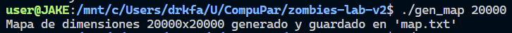
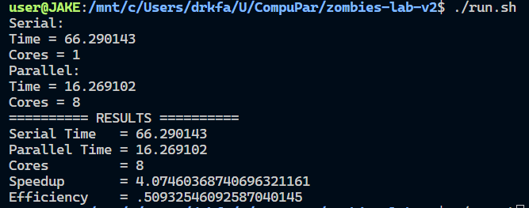

# zombies-lab

## **Versión en C++ y OpenMP**

**Ejecutables:**

**Generar Mapa**
```
gcc -o gen_map helpers.c -fopenmp
./gen_map <Tamaño del mapa>
```

**Simulación y Comparación**
- **Simulación en conjunto**
    ```
    ./run.sh
    ```


- **Versión Serial**
    ```
    gcc zombie_serial.c -O2 -o zombie_serial
    ./zombie_serial <archivo txt del mapa> <Días se simulación> 
    ```

- **Version Paralela**
    ```
    gcc zombie_omp.c -O2 -fopenmp -o zombie_omp
    ./zombie_omp <archivo txt del mapa> <Días se simulación> <Hilos>
    ```

### Ejemplo de Ejecución

- **Generación de mapa**


- **Ejecución y Comparación**


## **Versión en Python**

